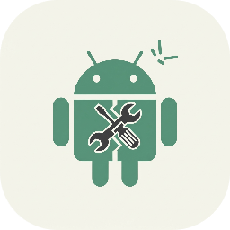

<div align="center">
    
</div>

<h1 align="center">DebugManager</h1>

<div align="center">

A Compose Multiplatform Desktop software, for Android device debugging.

[![Windows][windows-image]][release-url]
[![macOS][mac-image]][release-url]
[![Linux][linux-image]][release-url]
[![Downloads][download-image]][release-url]
![License][license-image]

</div>

[windows-image]: https://img.shields.io/badge/-Windows-blue?style=flat-square&logo=windows

[mac-image]: https://img.shields.io/badge/-macOS-black?style=flat-square&logo=apple

[linux-image]: https://img.shields.io/badge/-Linux-yellow?style=flat-square&logo=linux

[download-image]: https://img.shields.io/github/downloads/stepheneasyshot/debugmanager/total?style=flat-square

[release-url]: https://github.com/stepheneasyshot/debugmanager/releases

[license-image]: https://img.shields.io/github/license/stepheneasyshot/debugmanager?style=flat-square

## Introduction
This is a desktop software for debugging Android devices, particularly in-car systems. It is based on Compose Multiplatform and supports Windows, Linux, and macOS platforms.

On macOS, you need to grant execution permissions to the scrcpy and adb executables first by running the following command:

```bash
cd /Applications/DebugManager.app/Contents/app/resources/
chmod -R +x *
```

## Declaration
This software is for learning and communication purposes only. Do not use it for illegal activities, or you will be responsible for the consequences.

## Feature Description

### Device Information


1. Root and Remount: Clicking these buttons automatically executes adbd to gain root access and remount the filesystem. In most cases, these operations are performed automatically upon software startup, but in special scenarios, they may need to be manually triggered. If you have just flashed a new system, it is best to reboot the device immediately after starting the software to ensure the filesystem reloads properly, otherwise many file-related functions may fail.
2. Capture Trace: Used for performance analysis. It automatically records a 10-second trace. The trace file will be automatically extracted to the desktop upon completion.
3. Open Google Settings: Can open the built-in native Settings app. This is typically used when you need to enable specific debugging switches.
4. Fastboot and Recovery: These operations will reboot the device directly into the corresponding mode.
5. Open Screencast: Mirrors the in-car system's screen to your computer. Useful when the test bench lacks a screen or for long-distance device operation.
6. Screen Recording: You can set a custom recording duration. During the recording, a small dot will appear to show finger tap locations. After the preset time, the recorded MP4 file will be automatically extracted to your desktop, and the tap location dot will no longer be displayed.
7. Screenshot: Automatically extracts a screenshot of the current screen display to your desktop. It is recommended to click "Clear Cache" after use to save space on the device.
8. At the bottom, there are buttons to simulate key inputs, such as back, home, power (on/off), and volume up/down. You can also type text into the input field; this function currently only supports English letters and numbers.

### APP Management


1. Install App: The "Software Installation" function at the top allows you to select an APK file from your computer. By configuring the correct installation parameters (e.g., downgrade, overwrite), you can install the APK onto the system. This is typically used for verifying third-party APKs. Note that system-built-in priv-apps cannot be updated with the install function; you must use the "Push" function below to replace them.
2. App List: The app list below shows the name, version, package name, and update time of apps on the system. You can choose to display a simplified list or all apps. On the far right of each entry, a three-dot menu opens a detailed operation pop-up.
3. Left-clicking on each icon opens a pop-up window that displays information about the app, such as the version number, package name, and installation path. Right-clicking the icon opens a menu with options to launch the app's main interface, force stop it, extract the APK to a local directory, view information, and more.

### File Management


The file management interface provides more detailed file operations:

1. Delete: You can delete files and folders on the Android device.
2. Push/Pull: It supports pushing files from your computer and pulling files from the Android device.
3. Drag-and-Drop: The push function now supports drag-and-drop.
4. Warning: Non-professionals should not delete or move files to avoid causing device malfunctions.
5. Quick Access: The top provides shortcut buttons to navigate to the parent directory, root directory, sdcard page, and priv-app page for quick directory switching.

### Command Interface


1. This page provides debugging functions for entering commands.
2. Terminal: The left side is for terminal commands, which can execute simple, low-privilege commands.
3. ADB: The right side is for ADB operations. Note that it lacks a context mechanism and is suitable for single-shot commands like reboot, sending broadcasts, updating system databases, or launching activities/services.
4. Voice Simulation: For in-car systems, we have also integrated a visible voice simulation for quick debugging.
5. CarService Signal Simulation: The internal version also supports visual simulation of carservice signals.

### Performance Monitoring


1. System Overview: The left side provides a general overview of system usage, showing CPU and memory information.
2. App Details: The right side shows the CPU and memory usage for each process within a specific app.

### AI Experience


It feels outdated for software today to not integrate a large language model, so a simple chat UI has been created.

Currently, it is integrated with the Kimi and Deepseek developer platforms, with plans to integrate a local model based on llama.cpp in the future.

### About

1. Information: Displays the software version and links to the open-source project.
2. Cache Folders: Provides quick access to two cache folders on your computer.
3. Theme: Includes a theme-switching function with light and dark themes and a gradient animation. There are plans to fully adapt to Material Design and add more dynamic themes later.
4. Language: Supports English and Chinese languages now.


### Adaptive Layout

Supports adaptive layout with minimum window size settings, fluid layout, and automatic sidebar collapse.

Ensures good interaction and page performance across different window sizes.

Here are some screenshots of the adaptive layout in action:

<div style="display: flex; justify-content: center;">
  
  
</div>

### Singleton and Multi-window

Previously, singleton behavior was handled by a file-lock detection mechanism, where the process would exit if a lock file was found in the cache directory.

Starting from version 2.4.0, a multi-window mechanism has been introduced. If an instance is already running, a warning window is displayed to block further data processing logic, notifying the user that the application cannot be run multiple times.


### Multi-language Support
Starting from version 2.6.0, multilingual support has been added. It currently includes Chinese, English, Russian, Hindi, Spanish, French, German, Korean, Japanese, and Arabic.


### Open-Source Libraries Used

1. [AYA Server](https://github.com/liriliri/aya) The previous method for retrieving app icons involved installing an APK and launching a service, which required dealing with permission issues. Using the AYA Server, a DEX file is pushed to the device to hook system services, which then starts as a Linux process to store the icons.
2. [scrcpy](https://github.com/Genymobile/scrcpy) To offer a plug-and-play experience for non-technical users without requiring them to set up environment variables or other configurations, I use the scrcpy open-source project's official release files, which contain both the screen-mirroring and ADB tools.
3. [Ktor](https://ktor.io/) Used for building the HTTP service.
4. [Koin](https://insert-koin.io/) Used for dependency injection.
5. [Coil](https://coil-kt.github.io/coil/) Used for image loading.
6. [DataStore](https://klibs.io/project/androidx/androidx) Used for persistent storage of theme and language.
